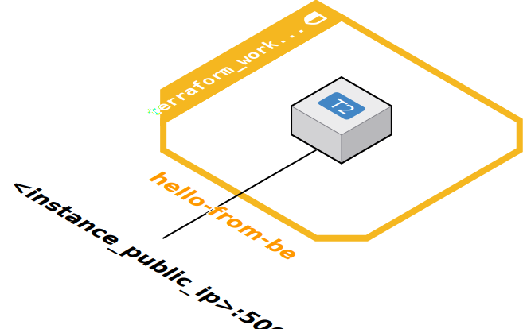

# State 1
## Infrastructure

## HCL
Hashicorp configuration language is the native Terraform sixtax, it was develop to be easier for human reading.  
[more info](https://www.terraform.io/docs/language/syntax/configuration.html)
## Provider
The Terraform providers are plugins that works as abstractions to interact with cloud providers APIs.  
[more info](https://www.terraform.io/docs/language/providers/index.html)
## Resource
Resources are Terraform elements that describes and configure each infrastructure components.  
[more info](https://www.terraform.io/docs/language/resources/index.html)
## Init
`terraform init` this is a command that initializes working directory, it should be executed to clone a new terraform component as provider or module.  
[more info](https://www.terraform.io/docs/cli/commands/init.html)
## Plan
`terraform plan` this command generates a preview of every infrastructure modification that will be deployed or destroyed.  
[more info](https://www.terraform.io/docs/cli/commands/plan.html)
## Apply
`terraform apply` this command gets the plan and executes on the cloud providers.  
[more info](https://www.terraform.io/docs/cli/commands/apply.html)
## EC2 instance
Amazon Elastic Compute Cloud (Amazon EC2) provides securem resizable compute capacity in the cloud.  
[more info](https://aws.amazon.com/ec2/?did=ft_card&trk=ft_card&ec2-whats-new.sort-by=item.additionalFields.postDateTime&ec2-whats-new.sort-order=desc)
## Security group
A security group is a amazon solution that works as a virtual firewall to control the access to aws resources.  
[more info](https://docs.aws.amazon.com/vpc/latest/userguide/VPC_SecurityGroups.html)
## State
state is how terraform store the state of managed infrastructure to keep track of changes in the infrastructure.  
[more info](https://www.terraform.io/docs/language/state/index.html)
## Local tfstate
`terraform.tfstate` this file is the default way to store terraform state and it is saved where terraform was executed.  
[more info](https://www.terraform.io/docs/language/settings/backends/local.html)
## Destroy
`terraform destroy` this command is a way to destroy all remotes managed components.  
[more info](https://www.terraform.io/docs/cli/commands/destroy.html)
## User data
User data a tool of aws instances to provision instances at launch time.  
[more info](https://docs.aws.amazon.com/es_es/AWSEC2/latest/UserGuide/user-data.html)
